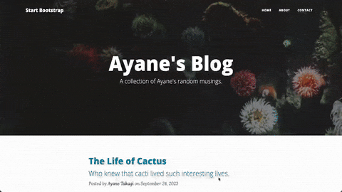

My Blog App 2 - Flask製ブログアプリ / Blog App built with Flask 2

📌 プログラム概要 / Program Overview
このブログアプリはPythonとFlaskを使用して作成されており、  
Bootstrapを使って、シンプルかつ見やすいUIを実装しています。

This blog application is built with Python and Flask, allowing users to see the posts.  
It uses Bootstrap to provide a simple and responsive UI.

📌 主な機能 / Key Features
1. Bootstrapによるスタイリッシュなデザイン / Responsive and stylish design with Bootstrap
4. npointによるデータ保存 / Data storage using npoint
5. Flaskのルーティングとテンプレートを活用 / Utilizes Flask routing and templates

📸 動作デモ / Demo:

