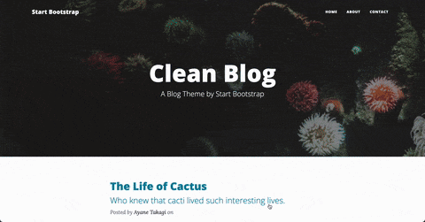
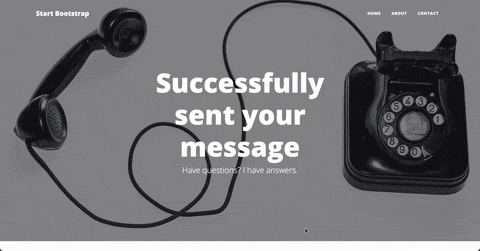

Flaskでお問い合わせフォームを実装 / Project 60 - Contact Form Integration with Flask

📌 プログラム概要 / Program Overview

このプロジェクトは、前回のブログウェブサイトのアップグレード版です。
今回のメインのゴールは、お問い合わせフォームをFlaskで動作させることでした。

This project is an upgraded version of a previous blog website.
The main focus of this project was to make the Contact Form functional using Flask.

📌 主な機能 / Key Features
1. Bootstrapでスタイリングされたお問い合わせページ / Contact page with a working HTML form
2. 名前・メール・電話番号・メッセージの送信が可能 / Ability to submit name, email, phone, and message through the form
3. FlaskサーバーでPOSTデータを受け取り / Flask server captures the form data via POST method
4. テスト用にサーバーコンソールに出力 / Data is currently printed in the server console for testing
5. WhatsAppに送られてきたデータを送信機能 / Sending the submitted data via WhatsApp

📌 学んだこと / What I Learned

Bootstrapを使ったフォーム作成とスタイリング方法 / How to create and style forms with Bootstrap
HTMLフォームのactionとmethod属性の役割 / How HTML form action and method attributes work
FlaskでPOSTリクエストを処理する方法 / How to handle POST requests in Flask
request.formで送信されたデータを取得する方法 / How to access form data with request.form
GETとPOSTを1つのルートで処理する方法 / How to set up routes for both GET and POST in the same Flask view function

📸 動作デモ / Demo:

