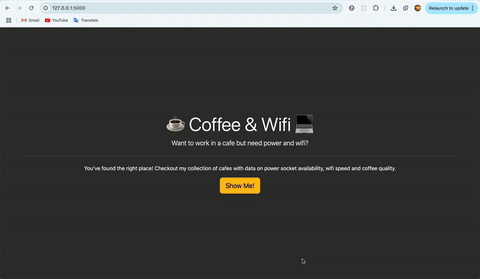
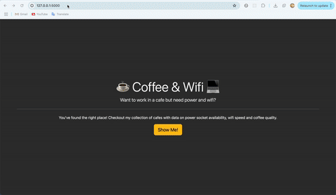

# Cafe & Wifi Management System

## 📌 Overview / 概要

This project is a web application built with **Flask**, **WTForms**, and **Bootstrap-Flask**.  
The goal is to create a simple **cafe information management system**.  
It includes features such as:
- Displaying cafe data from a CSV file
- Adding new cafe data through a form
- Ensuring proper validation for URLs

このプロジェクトは **Flask**、**WTForms**、**Bootstrap-Flask** を使用して作成されたウェブアプリケーションです。  
目的は、シンプルな **カフェ情報管理システム** を作成することです。  
以下の機能が含まれています：
- CSVファイルからカフェデータを表示
- フォームを通じて新しいカフェデータを追加
- URLの適切なバリデーションを実施

---

## 📌 Features / 機能

- Display cafe information from a CSV file in a **Bootstrap table**
- Add new cafes using a form with **proper field validation**
- Display a link to the cafe's location as an anchor tag with the text "Maps Link"
- Navigate between pages such as the home page and cafe page
- Use **Flask-WTF** for **form handling** and **validation**

- CSVファイルからカフェ情報を **Bootstrapテーブル** で表示
- **適切なフィールドバリデーション**を備えたフォームで新しいカフェを追加
- カフェの場所へのリンクを **「Maps Link」** のテキストでアンカータグとして表示
- ホームページとカフェページなど、ページ間を移動
- **Flask-WTF** を使用してフォームの処理とバリデーションを行う
---

## 📌 Technologies / 使用技術

- **Flask** - A lightweight web framework for Python / Python用の軽量ウェブフレームワーク
- **WTForms** - A form handling library for Flask / Flask用のフォーム処理ライブラリ
- **Bootstrap-Flask** - A Flask extension for Bootstrap integration / Bootstrap統合のためのFlask拡張機能
- **CSV** - Used for storing and reading cafe data / カフェデータの保存と読み取りに使用

## 📸 Demo / 動作デモ

Home page

Add page

