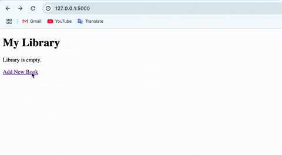

# Library Management System with Flask

## 📌 Overview / 概要

This is a simple library management system built with Flask and SQLAlchemy, 
where users can add, update, and delete books. 
It allows updating book ratings and viewing a list of books stored in the database.

FlaskとSQLAlchemyを使って作成したシンプルな図書管理システムです。
本の追加、更新、削除ができ、評価を更新する機能や、データベースに保存されている本のリストを表示できます。

---

## 📌 Features / 機能

- Add Books
- Update Book Ratings
- Delete Books
- Displays a list of all books stored in the database
- Each operation (update, delete) is linked to a specific book by ID.

- 本の追加
- 本の評価の更新
- 本の削除
- データベースに登録されている本の一覧を表示
- 各操作（更新・削除）は本のIDで特定される

---

## 📌 Technologies / 使用技術

- Python 3
- Flask
- SQLAlchemy
- Jinja2
- WTForms
- Bootstrap

---

## 📸 Demo / 動作デモ

Home page

