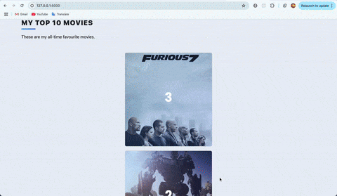
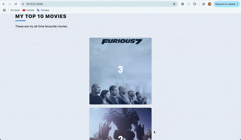

# Movie Ranking Website

## 📌 Overview

This project is a movie ranking website built using Flask, WTForms, SQLite, and SQLAlchemy. 
The website allows users to create, edit, and delete entries for their favorite movies. 
Users can also rank movies based on ratings, view their list of top movies, 
and add new movies using an API to fetch movie data.
 
 
このプロジェクトは、Flask、WTForms、SQLite、およびSQLAlchemyを使用して構築された映画ランキングウェブサイトです。
ウェブサイトでは、ユーザーが好きな映画のエントリを作成、編集、削除でき、
映画を評価に基づいてランク付けし、トップ映画のリストを表示することができます。
また、APIを使用して映画のデータを取得し、新しい映画を追加することもできます。

---

## 📌 Features

View Movie List Items / 映画リストの表示

- Title
- Year
- Description
- Rating
- Ranking
- Review
- Image URL

Edit Movie Rating and Review / 映画の評価とレビューの編集 
Delete Movies from the Database / データベースから映画を削除
Add New Movies via the Add Page / 映画の追加ページ  
Sort and Rank Movies by Rating / 評価による映画の並べ替えとランキング  

---

## 📌 Technologies

- Python 3.x
- Flask
- WTForms
- SQLite
- SQLAlchemy
- Requests library for API calls

---

## 📌 Database Structure

The database is an SQLite database created with SQLAlchemy. It contains a Movie table with the following fields:
データベースは、SQLAlchemyで作成されたSQLiteデータベースです。以下のフィールドを持つMovieテーブルがあります：

- id (integer, primary key)
- title (string, unique)
- year (integer)
- description (text)
- rating (float)
- ranking (integer)
- review (text)
- img_url (string)

---

## 📌 API

This project uses The Movie Database (TMDb) API to fetch movie data. The API is used in the following ways:

- Fetching Movie Details: When a user searches for a movie title, the app sends a request to the TMDb API's search endpoint to fetch a list of movies matching the title.
    - API Endpoint: [Search Movies](https://developer.themoviedb.org/reference/search-movie)
- Fetching Specific Movie Data: After selecting a movie, the app uses the movie’s ID to fetch detailed information, including the movie poster, description, and year of release.
  - API Endpoint: [Get Movie Details](https://developer.themoviedb.org/reference/movie-details)

To use the TMDb API, you'll need to sign up for a free account and obtain an API key from [TMDb](https://www.themoviedb.org/).

***

このプロジェクトでは、映画データを取得するためにThe Movie Database (TMDb) APIを使用しています。APIは以下の方法で使用されています：

- 映画の詳細を取得 ユーザーが映画タイトルを検索すると、アプリがTMDb APIの検索エンドポイントにリクエストを送信して、タイトルに一致する映画のリストを取得します。
    - APIエンドポイント: [映画検索](https://developer.themoviedb.org/reference/search-movie)
- 特定の映画データを取得 映画を選択した後、アプリは映画のIDを使用して、映画のポスター、説明、公開年などの詳細情報を取得します。
    - APIエンドポイント: [映画詳細情報](https://developer.themoviedb.org/reference/movie-details)

TMDb APIを使用するには、[TMDb](https://www.themoviedb.org/)で無料アカウントを作成し、APIキーを取得する必要があります。

---

## 📸 Demo

Home page  

Update and delete page  

Add page  

